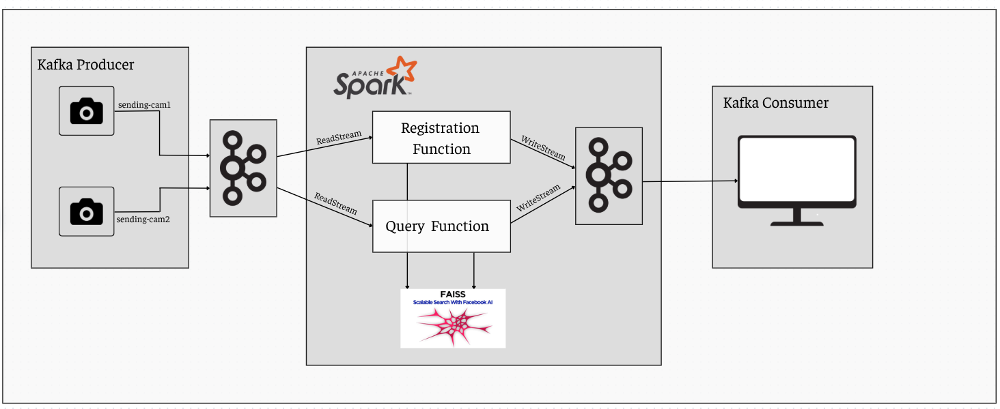

# VreID: Cross Camera Vehicles Re-Identification.  

## Introduction  
This repository is to integrate [Re-Identification-Project](https://github.com/PhamDuy204/Re-Identification-Project) by [@PhamDuy204](https://github.com/PhamDuy204) to Spark-Kafka pipeline, thereby allowing realtime processing.  
Visiting his repository for detailed information or see it directly in the folder named Re-Identification-Project.  

## Pipeline  
In this project, I use Kafka to streaming video and PySpark to process frame via UDF.   



## Preresquisite  
**Kafka** ``3.5.0``  
**Scala** ``2.13``   
**Python** ``3.9``  
**Ubuntu** ``22.04.5 LTS``

## Installation  

- Clone this repository  

```sh 
git clone https://github.com/HuaTanSang/VreID.git
```

- Installing dependencies   
```sh 
cd VreID
pip install -r requirements.txt  
cd Re-Identification-Project  
pip install -r requirements.txt  
cd deep-person-reid  
pip install -r requirements.txt 
python3 setup.py develop
cd ../..
```
- Starting **zoo-keeper** and **kafka-server**  
```sh
./kafka_2.13-3.5.0/bin/zookeeper-server-start.sh -daemon ./kafka_2.13-3.5.0/config/zookeeper.properties
./kafka_2.13-3.5.0/bin/kafka-server-start.sh -daemon ./kafka_2.13-3.5.0/config/server.properties
```

- Creating necessary topics  
```sh 
./kafka_2.13-3.5.0/bin/kafka-topics.sh --create --bootstrap-server 127.0.0.1:9092 --replication-factor 1 --partitions 1 --topic sending-cam1
./kafka_2.13-3.5.0/bin/kafka-topics.sh --create --bootstrap-server 127.0.0.1:9092 --replication-factor 1 --partitions 1 --topic sending-cam2

./kafka_2.13-3.5.0/bin/kafka-topics.sh --create --bootstrap-server 127.0.0.1:9092 --replication-factor 1 --partitions 1 --topic receive-cam1
./kafka_2.13-3.5.0/bin/kafka-topics.sh --create --bootstrap-server 127.0.0.1:9092 --replication-factor 1 --partitions 1 --topic receive-cam2 
```

- Running the consumer
```sh 
cd pipeline && python3 consumer.py 
```

- Running the producers  
```sh
python3 ./pipeline/producer_cam1.py --kafka_topic sending-cam1 --video_path path/to/the/first/video.mp4 

python3 ./pipeline/producer_cam2.py --kafka_topic sending-cam2 --video_path path/to/the/second/video.mp4 
```